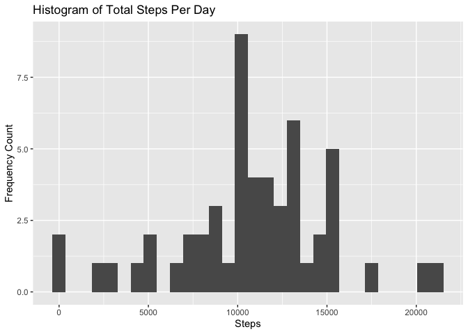

```r
knitr::opts_chunk$set(echo=TRUE)
library(tidyr)
library(dplyr)
```

```
## 
## Attaching package: 'dplyr'
```

```
## The following objects are masked from 'package:stats':
## 
##     filter, lag
```

```
## The following objects are masked from 'package:base':
## 
##     intersect, setdiff, setequal, union
```

```r
library(ggplot2)
```

## Load and preprocess the data
The date dimension was originally a 'char'. Best to change this to 'Date'.


```r
activity <- read.csv("activity.csv")
str(activity)
```

```
## 'data.frame':	17568 obs. of  3 variables:
##  $ steps   : int  NA NA NA NA NA NA NA NA NA NA ...
##  $ date    : chr  "2012-10-01" "2012-10-01" "2012-10-01" "2012-10-01" ...
##  $ interval: int  0 5 10 15 20 25 30 35 40 45 ...
```

```r
activity$date <- as.Date(activity$date)
str(activity)
```

```
## 'data.frame':	17568 obs. of  3 variables:
##  $ steps   : int  NA NA NA NA NA NA NA NA NA NA ...
##  $ date    : Date, format: "2012-10-01" "2012-10-01" ...
##  $ interval: int  0 5 10 15 20 25 30 35 40 45 ...
```

## What is mean total number of steps taken per day?
First, I needed to get the steps per day. Then I was able to get to the mean total number of steps per day.


```r
steps_per_day <- activity %>% group_by(date) %>% 
  summarize(steps_sum=sum(steps,rm.na=TRUE))
ggplot(steps_per_day,aes(x=steps_sum)) + geom_histogram() + 
  labs(title='Histogram of Total Steps Per Day',x='Steps',y='Frequency Count')
```

```
## `stat_bin()` using `bins = 30`. Pick better value with `binwidth`.
```

```
## Warning: Removed 8 rows containing non-finite values (stat_bin).
```

<!-- -->

```r
print(paste('Median total steps per day:',median(steps_per_day$steps_sum, 
  na.rm = TRUE)))
```

```
## [1] "Median total steps per day: 10766"
```

```r
print(paste('Mean total steps per day:',as.integer(mean(steps_per_day$steps_sum, 
  na.rm = TRUE))))
```

```
## [1] "Mean total steps per day: 10767"
```

## What is the average daily activity pattern?
I determined the average steps for each interval and then graphed it over time. Then I mapped the max back to the interval to highlight the most active interval on average.


```r
steps_per_interval <- activity %>% group_by(interval) %>% 
  summarize(steps_mean=mean(steps,na.rm = TRUE))
ggplot(steps_per_interval,aes(x=interval,y=steps_mean)) + geom_line() + 
  labs(title='Average Daily Activity',x='Interval',y='Step Mean')
```

<!-- -->

```r
max_interval <- steps_per_interval[steps_per_interval$steps_mean == 
                                     max(steps_per_interval$steps_mean),]$interval
print(paste('Interval with most steps on average:',max_interval))
```

```
## [1] "Interval with most steps on average: 835"
```

## Imputing missing values
I determined there were missing values for steps. I then replaced those with the interval average. I replotted the histogram and calculated the median and mean to see if there was much of a difference, which there wasn't.


```r
summary(activity)
```

```
##      steps             date               interval     
##  Min.   :  0.00   Min.   :2012-10-01   Min.   :   0.0  
##  1st Qu.:  0.00   1st Qu.:2012-10-16   1st Qu.: 588.8  
##  Median :  0.00   Median :2012-10-31   Median :1177.5  
##  Mean   : 37.38   Mean   :2012-10-31   Mean   :1177.5  
##  3rd Qu.: 12.00   3rd Qu.:2012-11-15   3rd Qu.:1766.2  
##  Max.   :806.00   Max.   :2012-11-30   Max.   :2355.0  
##  NA's   :2304
```

```r
print(paste("Total # of rows with missing NAs, which only occurs with 'steps': ",
  sum(!complete.cases(activity$steps))))
```

```
## [1] "Total # of rows with missing NAs, which only occurs with 'steps':  2304"
```

```r
activity_cleansed <- activity %>% group_by(interval) %>% mutate(steps = 
  replace_na(steps, mean(steps, na.rm = TRUE)))
steps_per_day_cleansed <- activity_cleansed %>% group_by(date) %>% 
  summarize(steps_sum=sum(steps))

ggplot(steps_per_day_cleansed,aes(x=steps_sum)) + geom_histogram() + 
  labs(title='Histogram of Total Steps Per Day, Cleansed',x='Steps',
       y='Frequency Count')
```

```
## `stat_bin()` using `bins = 30`. Pick better value with `binwidth`.
```

<!-- -->

```r
print(paste('Median total steps per day:',
  as.integer(median(steps_per_day_cleansed$steps_sum, na.rm = TRUE))))
```

```
## [1] "Median total steps per day: 10766"
```

```r
print(paste('Mean total steps per day:',
  as.integer(mean(steps_per_day_cleansed$steps_sum, na.rm = TRUE))))
```

```
## [1] "Mean total steps per day: 10766"
```

## Are there differences in activity patterns between weekdays and weekends?
First, I created a function to determine which days were weekdays or weekends. Then I did a panel plot, plotting the two side by side. Weekends have more activity throughout the day, as expected.

```r
wd_or_we <- function(x) {
  day_name<-weekdays(x)
  if(day_name=='Saturday' | day_name=='Sunday'){
    'weekend'
  } else {
    'weekday'
  }
}
activity_cleansed$day_type <- sapply(activity_cleansed$date,wd_or_we)
head(activity_cleansed)
```

```
## # A tibble: 6 × 4
## # Groups:   interval [6]
##    steps date       interval day_type
##    <dbl> <date>        <int> <chr>   
## 1 1.72   2012-10-01        0 weekday 
## 2 0.340  2012-10-01        5 weekday 
## 3 0.132  2012-10-01       10 weekday 
## 4 0.151  2012-10-01       15 weekday 
## 5 0.0755 2012-10-01       20 weekday 
## 6 2.09   2012-10-01       25 weekday
```

```r
to_plot <- activity_cleansed %>% group_by(day_type,interval) %>% 
  summarize(avg_steps=mean(steps))
```

```
## `summarise()` has grouped output by 'day_type'. You can override using the `.groups` argument.
```

```r
ggplot(to_plot,aes(x=interval,y=avg_steps)) + geom_line() + 
  facet_grid(day_type ~ .) + labs(title='Average Daily Activity',x='Interval',
                                  y='Step Mean')
```

<!-- -->
